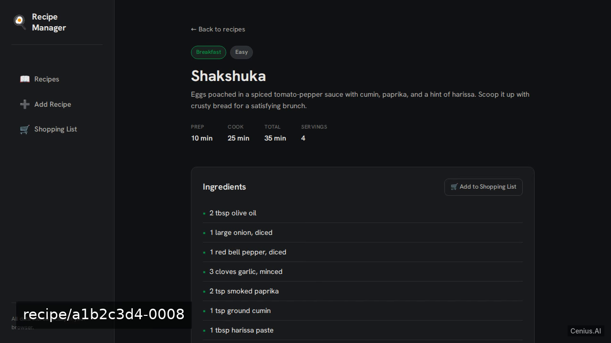
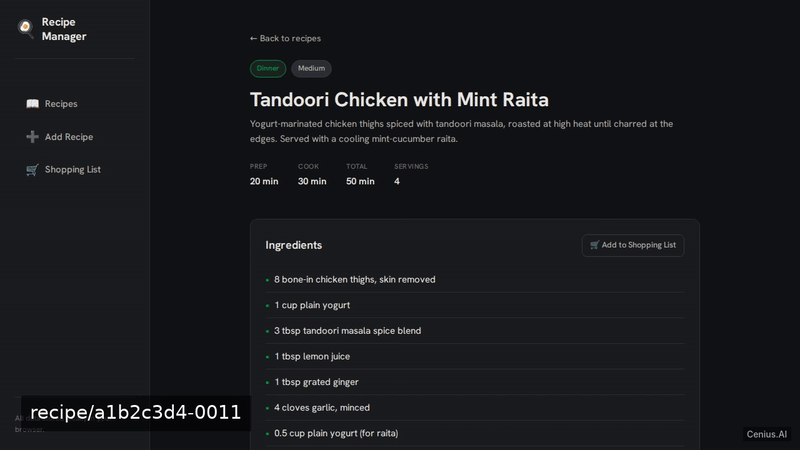
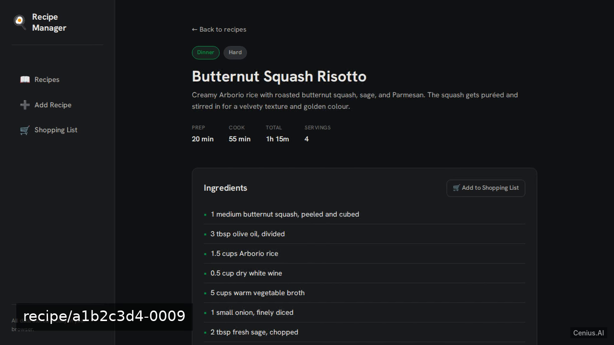
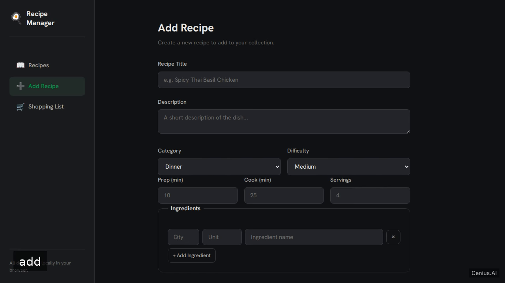

# Recipe Manager SPA — Vite recipe manager reference implementation

**Recipe Manager SPA** gives you two paths: self-host the Apache-2.0-licensed Vite source as your own recipe manager, or [open it on cenius.ai](https://cenius.ai/marketplace/p/recipe-manager-spa?ref=gh&utm_campaign=recipe-manager-spa-vite), describe the changes you want, and receive a new Recipe Manager SPA build with full rebrand rights. We'll build a Vue 3 + Vite single-page application for managing recipes with localStorage persistence. Everything ships in this repo — no paywall, no hidden features, no separate Recipe Manager SPA download.


[](LICENSE)  [](https://cenius.ai)

[](https://cenius.ai/marketplace/p/recipe-manager-spa?ref=gh&utm_campaign=recipe-manager-spa-vite)

> **▶ [Open & edit in cenius.ai](https://cenius.ai/marketplace/p/recipe-manager-spa?ref=gh&utm_campaign=recipe-manager-spa-vite)** — one click to an editable workspace: describe changes in plain English, get an instant preview, one-click deploy and host. Modifications made on the platform come with full rebrand & relicense rights.

_Local clone? See [Quick start](#quick-start) below. cenius.ai is the zero-setup path._

## Demo





▶ **[Watch the full demo video](https://cenius.ai/marketplace/p/recipe-manager-spa?ref=gh&utm_campaign=recipe-manager-spa-vite)** — the complete walkthrough, playing on the project's cenius.ai page · [MP4 file](.github/media/demo.mp4)

## Screenshots

  

## Quick start

```bash
./install.sh   # installs dependencies + seeds demo data
```

See [`INSTALL.md`](INSTALL.md) for full setup and usage instructions.

## Usage guide

### Browsing Recipes

The home page (`/`) shows all recipes grouped by category. Use the **search bar** at the top to find recipes by title, description, or ingredient name. Click a **category badge** to filter by category.

### Viewing a Recipe

Click any recipe card to open its detail page (`/recipe/:id`). You'll see:

- Prep time, cook time, total time, and servings
- Full ingredient list with quantities
- Numbered step-by-step instructions
- An **"Add to Shopping List"** button that copies all ingredients to your shopping list

Use the **Edit** button to modify the recipe, or **Delete** to remove it permanently.

### Creating a Recipe

Click **Add Recipe** in the left navigation (or visit `/add`).

The form supports:

- **Dynamic ingredient rows** — click "+ Add Ingredient" to add more rows; click ✕ to remove
- **Dynamic step rows** — click "+ Add Step" to add more steps; click ✕ to remove
- Category and difficulty dropdowns
- Numeric prep time, cook time, and servings

Fill in at minimum a title, at least one ingredient, and at least one step. Click **Save Recipe** to add it to your collection. You'll be redirected to the new recipe's detail page.

To edit an existing recipe, click the **Edit** button on its detail page — the form pre-fills with the current values.

### Managing the Shopping List

Visit `/shopping-list` (🛒 Shopping List in the nav).

_Full guide: [`USAGE.md`](USAGE.md)_

## Features

- Recipe list
- Recipe detail
- Add recipe
- Shopping list
- Seed demo recipes

## Architecture

Open the repo and you'll find a complete Vite application (25 files). Top-level layout: `src/`. `install.sh` takes care of packages and initial data in a single pass; nothing else is required before launching. Step-by-step setup guide: [`INSTALL.md`](INSTALL.md).

## FAQ

### What does it take to self-host Recipe Manager SPA?

Grab the repo and run `./install.sh` — it handles packages and seed data in one go. After that, [`INSTALL.md`](INSTALL.md) walks you through starting the server. No external accounts required.

### Is it possible to white-label Recipe Manager SPA for a client?

Rebranding is straightforward under the MIT license — change what you want in the source. Or [open it on cenius.ai](https://cenius.ai/marketplace/p/recipe-manager-spa?ref=gh&utm_campaign=recipe-manager-spa-vite): the platform handles the changes and grants full rebrand rights on the result.

### Is there a no-code way to modify Recipe Manager SPA?

[cenius.ai](https://cenius.ai/marketplace/p/recipe-manager-spa?ref=gh&utm_campaign=recipe-manager-spa-vite) handles the implementation. Tell it what you want in everyday words, pick up the updated build. No coding needed.

### What technologies are in Recipe Manager SPA's stack?

Vite. The full source in this repository is exactly what the app runs. Highlights include add recipe.

### Is it OK to ship Recipe Manager SPA as part of a product?

Yes. The code is Apache-2.0-licensed — use it, modify it, and ship it commercially. See [LICENSE](LICENSE).

## License & rebranding

Released under the [Apache License 2.0](LICENSE) (© 2026 Cenius AI) — free for personal and commercial use. The Cenius name/logo are trademarks (see NOTICE).

**Need a customized version?** [Remix this app on cenius.ai](https://cenius.ai/marketplace/p/recipe-manager-spa?ref=gh&utm_campaign=recipe-manager-spa-vite) — modifications made on the platform come with **full rebrand & relicense rights** over your derivative.

## Built with cenius.ai

This entire application — code, design, seeded demo data — was generated on **[cenius.ai](https://cenius.ai)** from a plain-English description.

- 🚀 [Build your own app on cenius.ai](https://cenius.ai)
- 🎛️ [Remix Recipe Manager SPA on the marketplace](https://cenius.ai/marketplace/p/recipe-manager-spa?ref=gh&utm_campaign=recipe-manager-spa-vite) — open it in a workspace, prompt for changes, and ship your own version.

More open-source apps: [the Cenius-ai catalog](https://github.com/Cenius-ai) · [showcase index](https://github.com/Cenius-ai/showcase)
